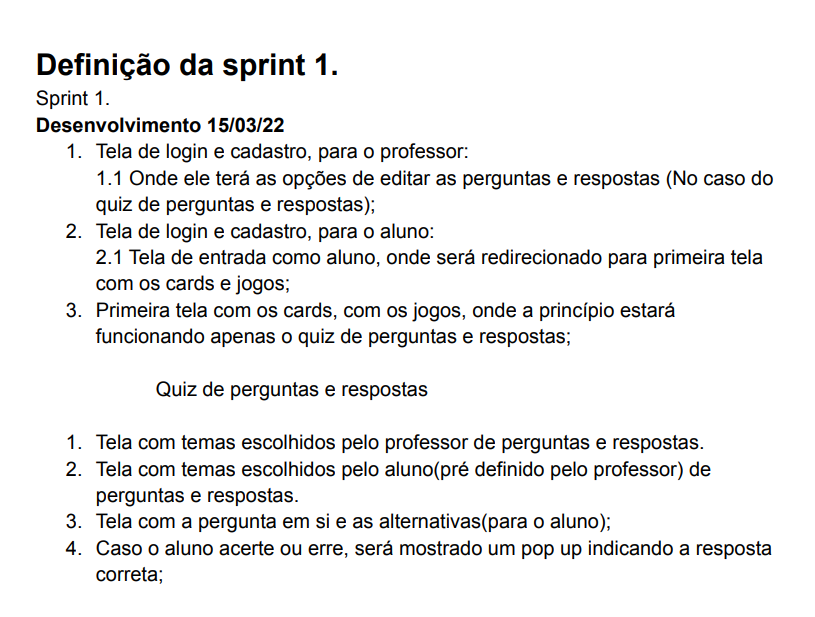
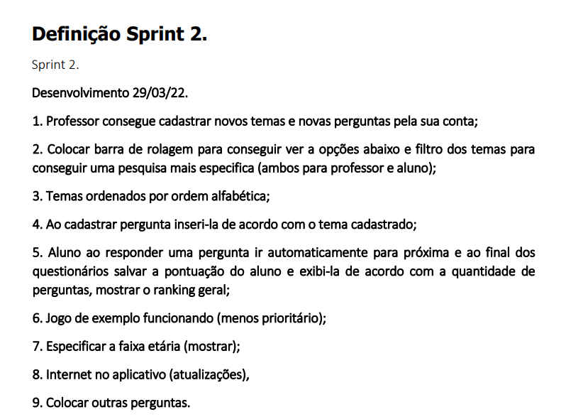
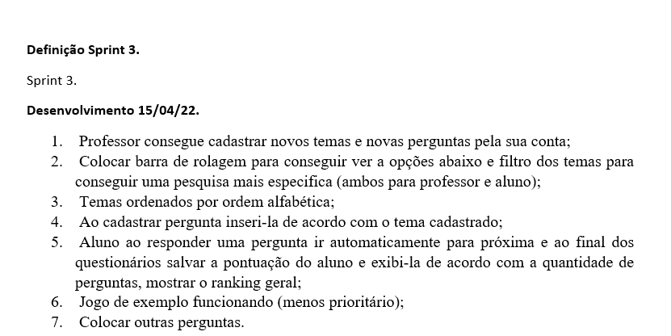
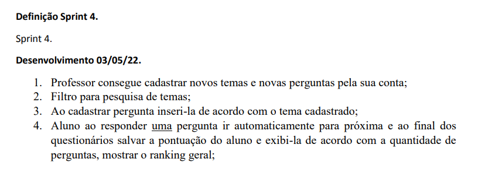
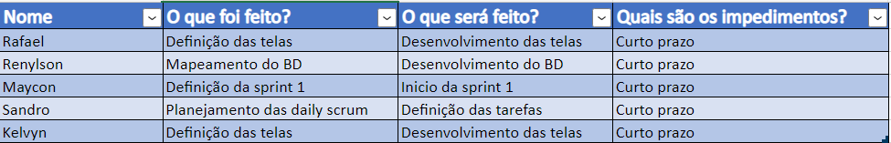

# Sprints 

 

## Sprint 1                                               

-O desenvolvimento da sprint 1 estava para desenvolvimento até dia 15/03/2022,
com os seguintes tópicos para a entrega:

1.Tela de login e cadastro, para professor:

    -1.1 Onde ele terá as opções de editar as perguntas e repostas(No caso do quiz de pergunta e respostas);

2.Tela de login e cadastro, para o aluno:

    -2.1 Tela de entrada como aluno, onde será redirecionado para primeira tela com os cards e jogos;

3.Primeira tela com os cards, com os jogos, onde a princípio estará funcionando apenas o quiz de perguntas e respostas.

**Quiz de perguntas e respostas**

    -1. Tela com temas escolhidos pelo professor de perguntas e respostas;

    -2. Tela com temas escolhidos pelo aluno(pré definido pelo professor) de perguntas e respostas;

    -3 Tela com a pergunta em si e as alternativas(para o aluno);

    -4 Caso o aluno acerte ou erre, será mostrado um pop up indicando a resposta correta.

-O time de desenvolvimento conseguiu concluir e cumprir com o prazo da Sprint 1 sem nenhum empecilho.

**Como pode ser observado na imagem abaixo, a documentação da primeira sprint:**
 
_________________________________________________________________________________________________________________________

## Sprint 2 

-O desenvolvimento da sprint 1 estava para desenvolvimento até dia 15/03/2022,
com os seguintes tópicos para a entrega:

    1. Professor consegue cadastrar novos temas e novas perguntas pela sua conta; 

    2. Colocar barra de rolagem para conseguir ver a opções abaixo e filtro dos temas para 
    conseguir uma pesquisa mais especifica (ambos para professor e aluno); 

    3. Temas ordenados por ordem alfabética; 

    4. Ao cadastrar pergunta inseri-la de acordo com o tema cadastrado; 

    5. Aluno ao responder uma pergunta ir automaticamente para próxima e ao final dos 
    questionários salvar a pontuação do aluno e exibi-la de acordo com a quantidade de 
    perguntas, mostrar o ranking geral; 

    6. Jogo de exemplo funcionando (menos prioritário); 

    7. Especificar a faixa etária (mostrar); 

    8. Internet no aplicativo (atualizações);

    9. Colocar outras perguntas.

-Nessa sprint, ocorreram os primeiros empecilhos, onde o problema foi a comunicação do banco
com a aplicação, deixando certas atividades sem continuidade até que o banco conseguisse se comunicar com 
a aplicação.

## Sprint 3
    
    1. Professor consegue cadastrar novos temas e novas perguntas pela sua conta;
    
    2. Colocar barra de rolagem para conseguir ver as opções abaixo e filtro dos temas para conseguir uma
    pesquisa mais especifica(ambas para professor e aluno);

    3. Temas ordenados por ordem alfabética;

    4. Ao cadastrar pergunta inseri-la de acordo com o tema cadastrado;

    5. Aluno ao responder uma pergunta ir automaticamente para próxima e ao final dos questionários salvar a 
    pontuação do aluno e exibi-la de acordo com a quantidade de perguntas, mostrar o ranking geral;

    6. Jogo de exemplo funcionando (menos prioritário);

    7. Colocar outrar perguntas.

-Nessa sprint, ocorreram outros empecilhos, onde o problema foi o framework, onde o ocorreram muitos problemas
de compatibilidade deixando as atividades sem continuidade, por outro lado a implementação do banco foi terminada
faltando apenas a conexão com o servidor.

## Sprint 4

    1. Professor consegue cadastrar novos temas e novas perguntas pela sua conta;

    2. Filtro para pesquisa de temas;

    3. Ao cadastrar pergunta inseri-la de acordo com o tema cadastrado; 

    4. Aluno ao responder uma pergunta ir automaticamente para próxima e ao final dos 
    questionários salvar a pontuação do aluno e exibi-la de acordo com a quantidade de 
    perguntas, mostrar o ranking geral;

-Essa sprint está em desenvolvimento ainda, conversando com o time de desenvolvimento e analisando a atividade
à serem entregues, a equipe optou por remover certas atividades que não seriam de importancia para o projeto.  

## Backlog

-Nesse Backlog, está prezente atividades da sprint 1 e também o inicio da implementação
do Banco de dados.

-[Backlog do projeto](https://trello.com/b/GgmmKsjz/backlog-livro-sem-texto)