# Telas do aplicativo mobile. 

## Tela de Cadastro

-Tela de cadastro do usuário, onde o usuário poderá se cadastrar tendo as opções de 
professor ou aluno, tendo certos privilegios que o usuário aluno não terá.

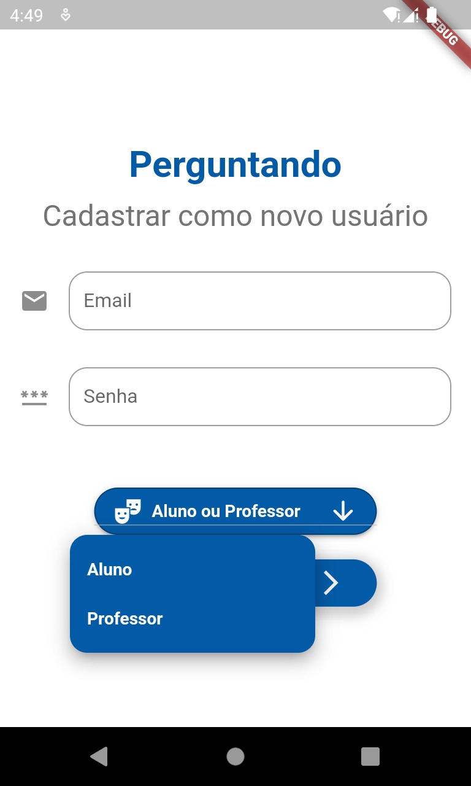 
**FIGURA 1**

## Tela de Login

-Tela onde o usuário irá acessar sua conta, sendo professor ou aluno.

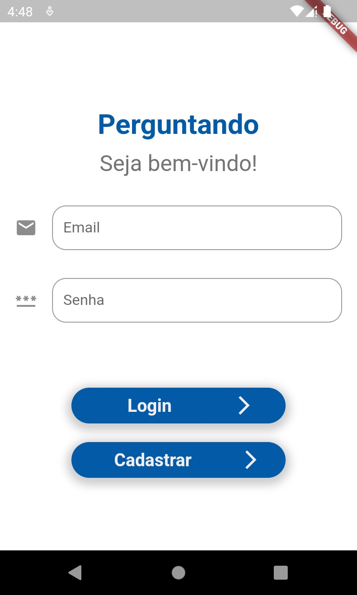 
**FIGURA 2**

## Tela Inicial do App

-Assim que o usuário fizer seu login, ele será direcionado para a página inicial onde contém 
os cards dos jogos.

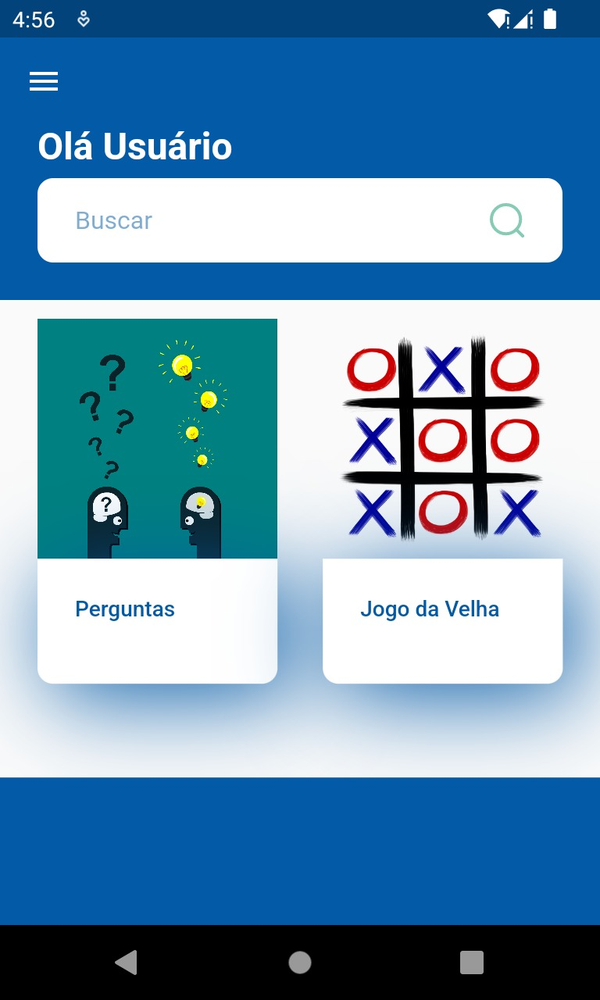
**FIGURA 3**

## Tela de Informações do Usuário

-Nessa tela, contém as informações do usuário.

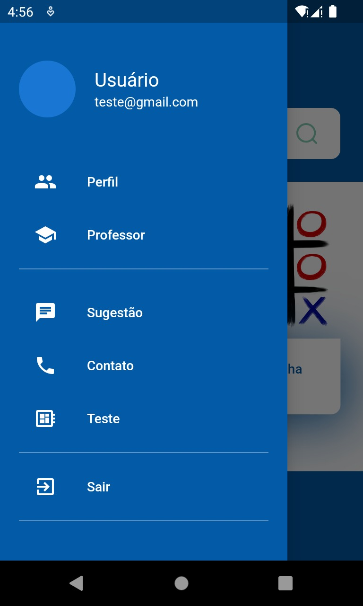
**FIGURA 4**

## Tela de adicionar perguntas e respostas

-O usuário cadastrado como professor terá o privilégio de poder adicionar perguntas e respostas,
podendo escolher as alternativas certas e selecionar para qual tema a pergunta será direcionada.

**FIGURA 5**

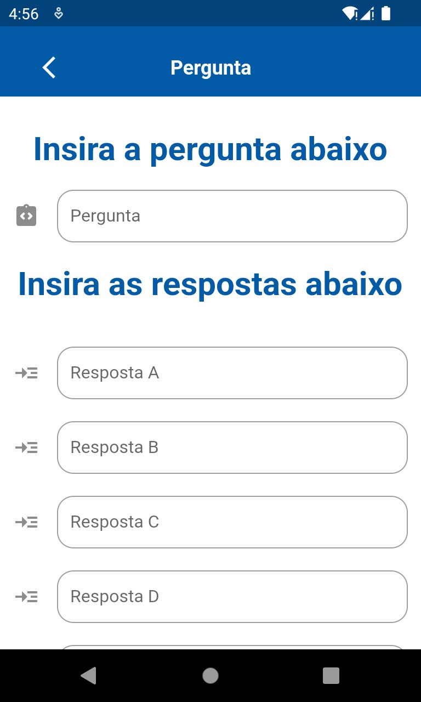
**FIGURA 6**

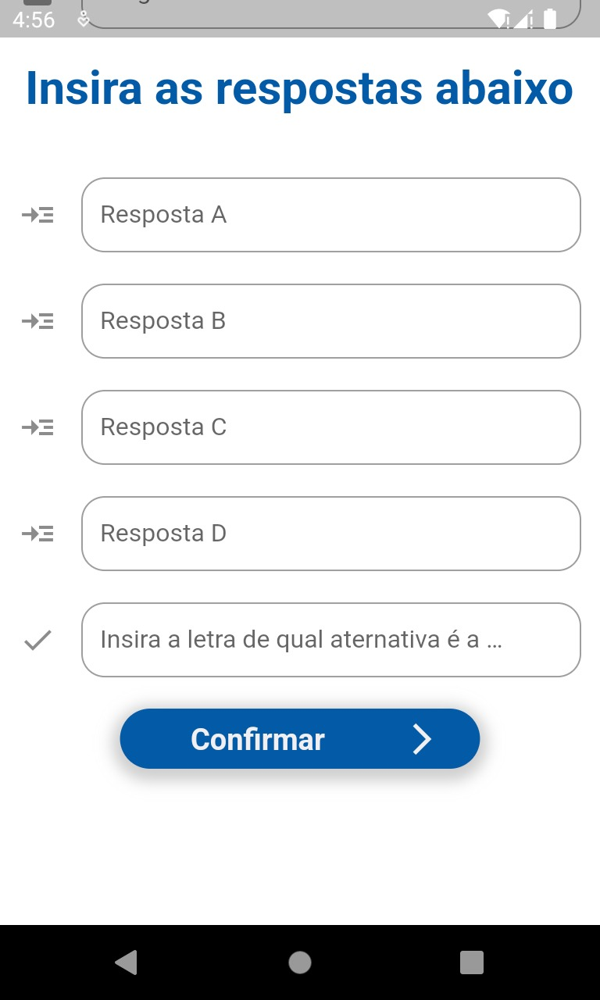
**FIGURA 7**

## Tela de adicionar temas

-O professor poderá cadastrar novos temas(matérias).

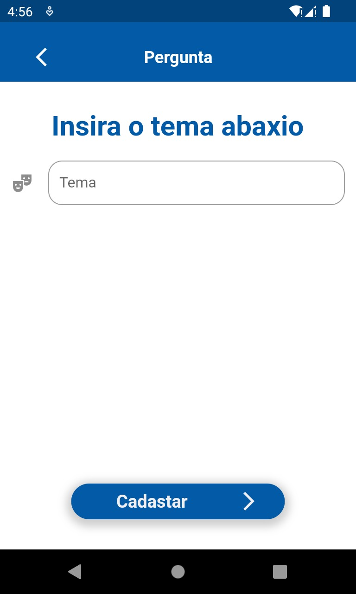
**FIGURA 8**

## Seleção de temas

-O usuário cadastrado como aluno, poderá escolher o tema no qual quer iniciar o quiz
de perguntas e respostas.

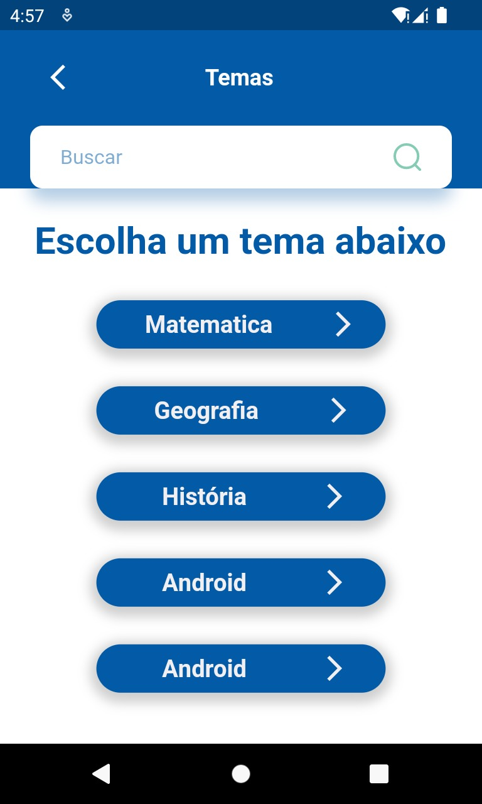
**FIGURA 9**

## Tela de jogo Matemático

-O aluno selecionou o tema matemática e iniciou o jogo.

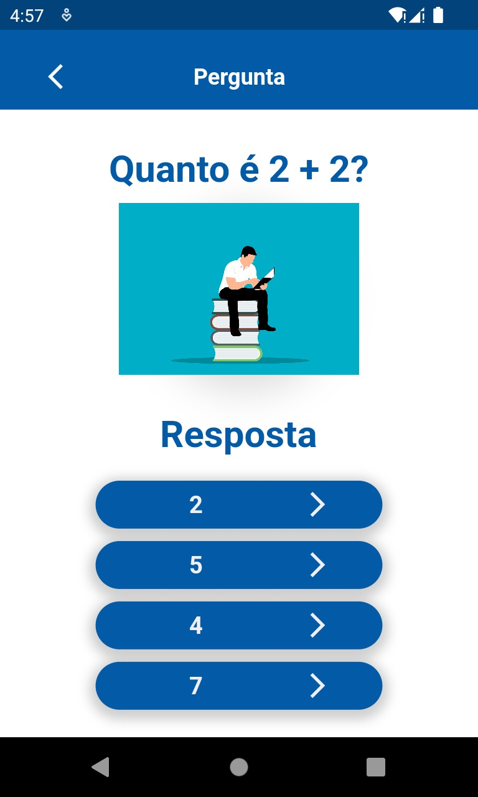
**FIGURA 10**

-Pop-up sinalizando se acertou a pergunta ou errou.

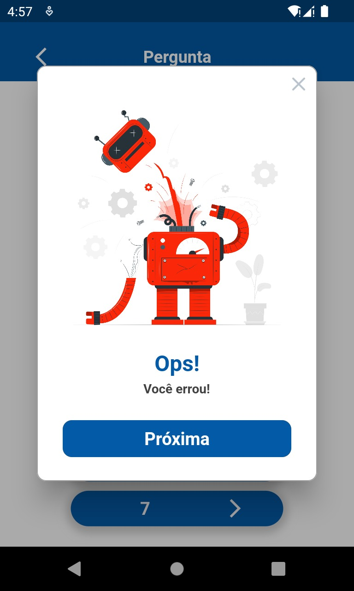
**FIGURA 11**

## Tela de jogo Exemplo

-Um jogo adicional, optamos por um jogo de xadrex.

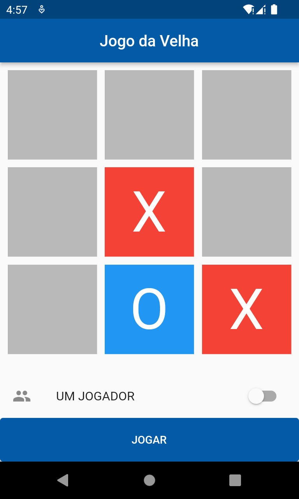
**FIGURA 12**

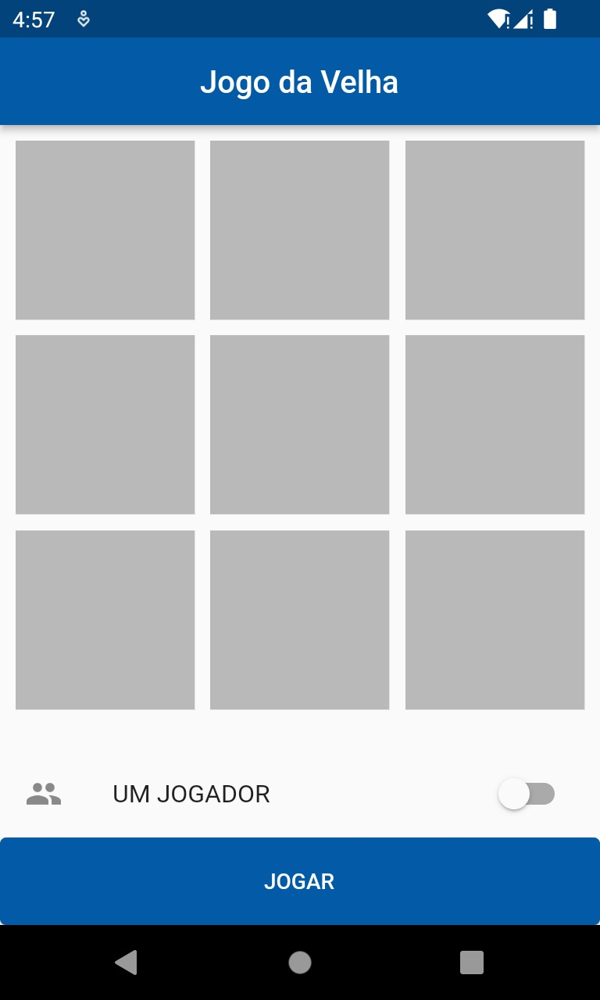
**FIGURA 13**
